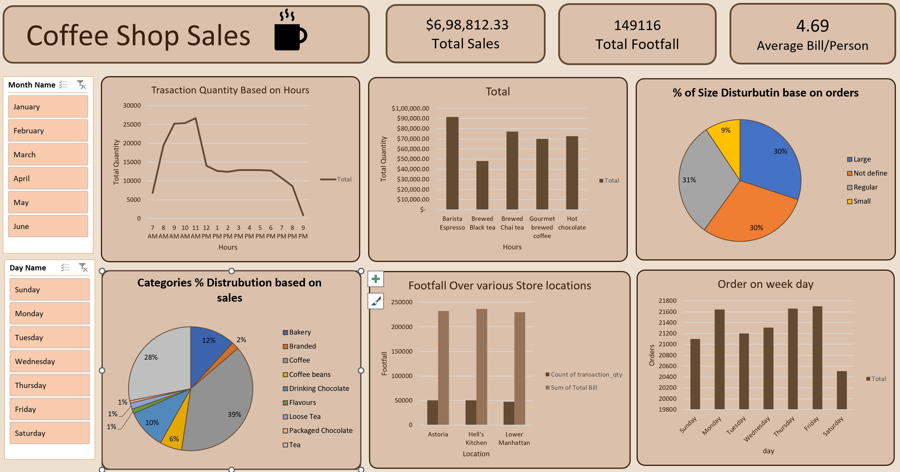

# Coffee Shop Sales Dashboard

## Overview

This repository contains a Power BI dashboard for analyzing sales and footfall data of a coffee shop. The dashboard provides various insights, such as sales distribution, transaction quantities, and customer footfall across different store locations and times of the day.



## Key Features

- **Total Sales:** Displays the total sales revenue.
- **Total Footfall:** Shows the total number of customers (footfall).
- **Average Bill/Person:** Calculates the average bill per person.
- **Transaction Quantity Based on Hours:** Graph showing the distribution of transaction quantities by the hour.
- **Sales Distribution by Product Category:** Pie chart showing the percentage distribution of sales across different product categories (e.g., coffee, bakery, tea, etc.).
- **Size Distribution Based on Orders:** Pie chart showing the distribution of orders by cup size.
- **Footfall Over Various Store Locations:** Bar chart showing customer footfall across different store locations.
- **Orders on Weekdays:** Bar chart displaying the number of orders on each day of the week.

## How to Use

1. **Clone the Repository:**
   ```bash
   git clone https://github.com/yourusername/coffeeshop-sales-dashboard.git
